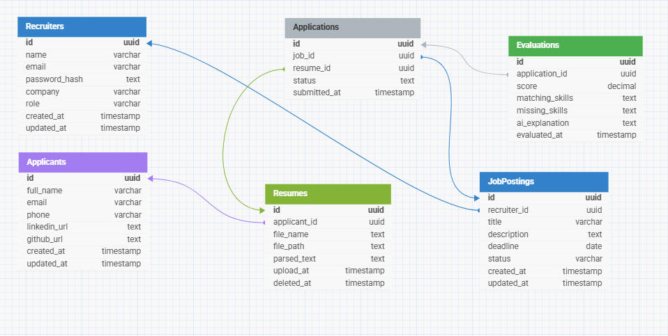

# Database Design

The database is designed around the recruitment workflow.

Applicants can apply to multiple job postings, with each application having its own uploaded resume. Once a resume has been submitted for a job application, it is preserved and cannot be replaced or versioned. This ensures that AI evaluations and recruiter reviews always reference the original submitted resume.

## Why PostgreSQL?

PostgreSQL was selected because it provides:

- ACID-compliant transactions for reliable data consistency
- Excellent performance for relational data
- Strong indexing capabilities for fast searching
- Native JSON support for AI metadata if required later
- Full-text search capabilities
- Easy integration with FastAPI through SQLAlchemy
- Open-source with excellent community support

The database is normalized to reduce redundancy while supporting future scalability.

---

# Database Tables

## Recruiters

Stores recruiter accounts.

| Column | Type | Constraints |
|---------|------|-------------|
| id | UUID | PK |
| name | VARCHAR(150) | NOT NULL |
| email | VARCHAR(255) | UNIQUE |
| password_hash | TEXT | NOT NULL |
| company | VARCHAR(200) | NOT NULL |
| role | VARCHAR(30) | DEFAULT 'RECRUITER' |
| created_at | TIMESTAMP | |
| updated_at | TIMESTAMP | |

---

## Applicants

Stores applicant information extracted from uploaded resumes.

| Column | Type |
|---------|------|
| id | UUID |
| full_name | VARCHAR(200) |
| email | VARCHAR(255) |
| phone | VARCHAR(30) |
| linkedin_url | TEXT |
| github_url | TEXT |
| created_at | TIMESTAMP |
| updated_at | TIMESTAMP |

---

## Resumes

Stores uploaded resume files and their extracted text.

| Column | Type |
|---------|------|
| id | UUID |
| applicant_id | UUID FK |
| file_name | TEXT |
| file_path | TEXT |
| parsed_text | TEXT |
| created_at | TIMESTAMP |
| updated_at | TIMESTAMP |
| deleted_at | TIMESTAMP NULL |

### Design Decision

Each uploaded resume is intended for a single job application.

Applicants may submit different resumes for different job postings.

Once a resume has been submitted as part of an application, it cannot be replaced or versioned. To apply for another job, the applicant uploads a new resume.

---

## JobPostings

Stores job postings created by recruiters.

| Column | Type |
|---------|------|
| id | UUID |
| recruiter_id | UUID FK |
| title | VARCHAR(200) |
| description | TEXT |
| deadline | DATE |
| status | VARCHAR(20) |
| created_at | TIMESTAMP |
| updated_at | TIMESTAMP |

### Design Decision

A recruiter can create multiple job postings.
The status field represents the current state of the job posting.

Allowed values:

- DELETED
- DRAFT
- PUBLISHED
- CLOSED

---

## Applications

Stores job applications submitted by applicants.

| Column | Type |
|---------|------|
| id | UUID |
| job_id | UUID FK |
| resume_id | UUID FK |
| status | VARCHAR(30) |
| created_at | TIMESTAMP |
| updated_at | TIMESTAMP |

### Design Decision

Each application links one uploaded resume to one job posting.

An applicant may submit multiple applications to different job postings using different resumes.

Application status values include:

- SUBMITTED
- UNDER_REVIEW
- SHORTLISTED
- INTERVIEW
- REJECTED

---

## Evaluations

Stores AI evaluation results for submitted applications.

| Column | Type |
|---------|------|
| id | UUID |
| application_id | UUID FK |
| score | DECIMAL(5,2) |
| matching_skills | TEXT |
| missing_skills | TEXT |
| ai_explanation | TEXT |
| created_at | TIMESTAMP |
| updated_at | TIMESTAMP |

### Design Decision

Each application receives one AI evaluation.

The evaluation stores:

- Overall matching score (0.00–100.00)
- Matching skills
- Missing skills
- AI-generated explanation

---

# Relationships

Recruiter
    1 → Many Job Postings

Applicant
    1 → Many Resume Versions

Resume
    1 → Many Applications

Job Posting
    1 → Many Applications

Application
    1 → One Evaluation

---

# Primary Keys

All tables use UUID primary keys.

---

# Foreign Keys

JobPostings.recruiter_id
→ Recruiters.id

Resumes.applicant_id
→ Applicants.id

Applications.job_id
→ JobPostings.id

Applications.resume_id
→ Resumes.id

Evaluations.application_id
→ Applications.id

---

# Normalization

The schema satisfies Third Normal Form (3NF).

- Recruiter information is stored independently.
- Applicant information is stored independently.
- Resumes are stored separately from applications.
- Applications associate resumes with job postings.
- AI evaluation results are stored separately from application records.
- No redundant recruiter or applicant information is stored.

---

# Business Rules

- A recruiter can create multiple job postings.
- An applicant can apply to multiple job postings.
- Each application requires a separate uploaded resume.
- A submitted resume cannot be modified or replaced.
- Each application receives exactly one AI evaluation.
- Evaluation scores range from 0.00 to 100.00.

---

# Entity Relationship Diagram

The following ER diagram illustrates the relationships between the system entities.

